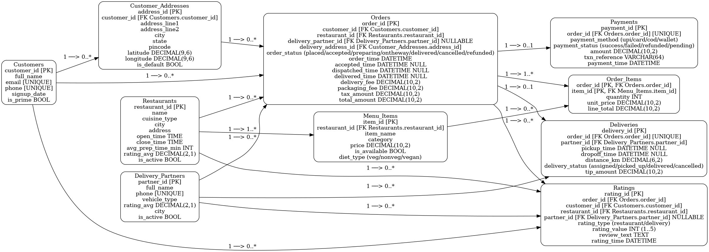

# 🍔 Food Delivery Database (SQL Project)

## 📌 Overview
This project models an **online food delivery system** (similar to Swiggy/Zomato) using SQL.  
It demonstrates **database design, schema creation, sample data, and analytical queries**.

## 🛠️ Tech Stack
- SQL (MySQL / PostgreSQL)
- ER Diagram (Graphviz)

## 📊 ER Diagram


## 📂 Project Structure
- `schema.sql` → Script to create tables with primary/foreign keys & constraints  
- `sample_data.sql` → Mock data (customers, restaurants, orders, etc.)  
- `queries.sql` → Analytical queries (e.g., revenue, top restaurants, customer insights)  
- `er_diagram.png` → Visual representation of the database schema  

## 🚀 How to Run
1. Clone this repository:
   ```bash
   git clone https://github.com/yourusername/food-delivery-db.git
   cd food-delivery-db
